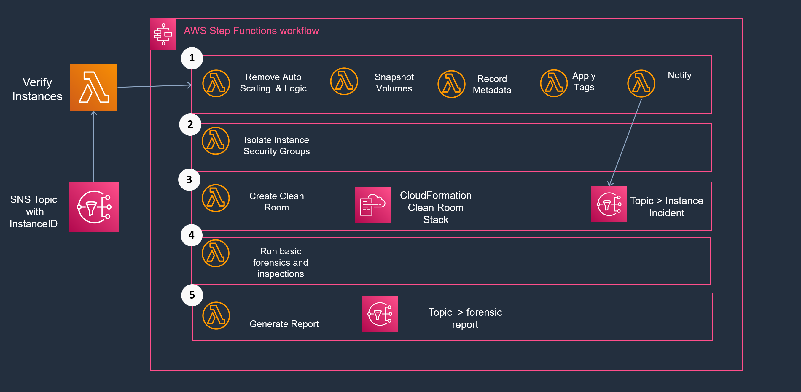

 

     
    
    <h3>Inspector AWSome</h3>

 

Tiny collection of scripts to isolate an EC2 instance and start with the joy of forensics.

In the case of a compromised EC2 instance within your fleet, it's time for getting prepared for Incident Response and Threat Hunting. To get started you have two Options:

1. Use the manual bash scripts located in `quick-manual-isolation` 
2. A predefined Step-Function that helps you to automate the isolation step as much as possible

## Quick Manual Isolation with some Bash Kung-Fu

You'll find the following scripts:

| Script name      | Semantics                 |
| -----------------|---------------------------|
| get-all-instances-since-date-x.sh | Collect |
| isolate-ec2-instance-internal.sh | dwd |
| isolate-ec2-instance-external.sh | dwd |

## Step Function Kung-Fu

The easiest way in is this overview:

Like shown above - the StepFunction will take an instance ID passed by an SNS topic through a series of Lambda Functions. During the execution the Step Function will automatically notify, isolate and run basic forensics.

## Disclaimer 

I'm not responsible for any misuse, mistakes and possible loss of money by executing those scripts